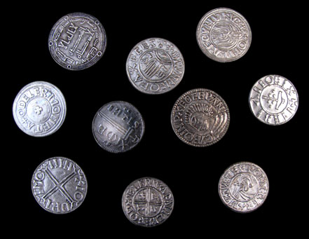
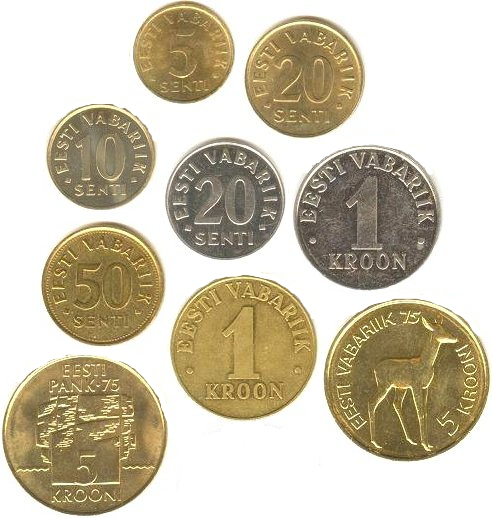
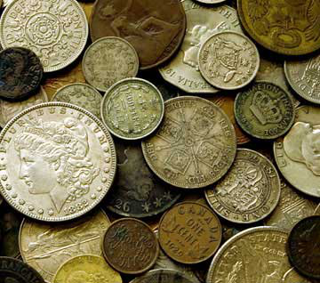
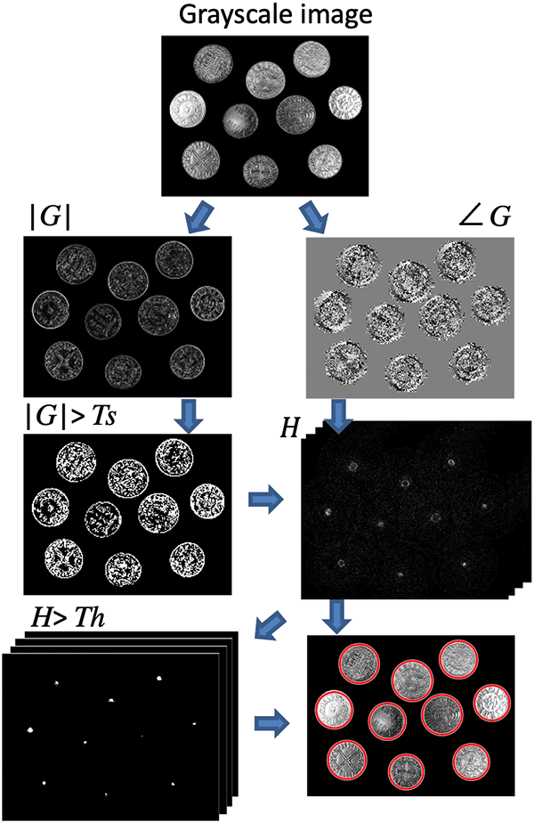

# Lab 3: Coin Counter Challenge

> We run our labs with [Python 3.6+](https://www.python.org/downloads/).
> For Windows, you might want to use [Conda](https://www.anaconda.com/products/distribution). 

## Using the lab sheet

There are two ways to use the lab sheet, you can either:

- [create a new repo from this template](https://github.com/UoB-CS-IPCV/Lab3-Coin-Counter-Challenge/generate) - **this is the recommended way**
- download a [zip file](https://github.com/UoB-CS-IPCV/Lab3-Coin-Counter-Challenge/archive/master.zip)

## Overview

- Counting objects is an essential task in many vision applications. 
- Your task is to implement an OpenCV program that can count round coins from basic imagery by utilising the Hough transform. 
- Try to implement the Hough transform explicitly, that is without using the pre-implemented function calls for the Hough Transform. You can utilise your code from former labs.
- This task will be formative and we will, as always, be there during labs to provide you with help and feedback. The assignment is to be worked on individually and will prepare you for the upcoming summative assessment.

   

## Task 1: Sobel Edge Detection

As detailed in this week’s lecture, the detection of edges is pivotal in the task of distinguishing shapes. Your first task is to implement the Sobel edge detector by convolving an image with the Sobel kernels and calculate the gradient information. (without using the convolutional and sobel functions offered by OpenCV.)

### Task Breakdown

1. Implement a function `sobel`.
2. This function should take an image as an input and compute the following
    - Image containing the derivative in the $x$ direction $\frac{\partial f}{\partial x}$
    - Image containing the derivative in the $y$ direction $\frac{\partial f}{\partial y}$
    - Image containing magnitude of the gradient $\nabla f(x,y)$
    - Image containing the direction of the gradient $\rho$
3. Be able to display the four images above and discuss their appearance in relation to the original image.

    
Hint

$$\frac{\partial}{\partial x} \approx {\left\lbrack \matrix{-1 & 0 & 1 \cr -2 & 0 & 2 \cr -1 & 0 & 1} \right\rbrack}, \ \ \frac{\partial}{\partial y} \approx {\left\lbrack \matrix{-1 & -2 & -1 \cr 0 & 0 & 0 \cr 1 & 2 & 1} \right\rbrack}$$

$$grad(f) = |\bigtriangledown f(x,y)| = \sqrt{\left(\frac{\partial f}{\partial x}\right)^2 + \left(\frac{\partial f}{\partial y}\right)^2}, \ \ \psi = \text{arctan}\left( \frac{\partial f/\partial y}{\partial f/ \partial x} \right) $$

    
Hint

If you have an error: ZeroDivisionError: division by zero, add a small value to denominator, e.g. $$\psi = \text{arctan}\left( \frac{\partial f/\partial y}{\partial f/ \partial x + e^{-10}} \right) $$

### Implementation Details

1. Implementation of a Sobel filter requires convolution. You have already used convolution in OpenCV for last week's task - so feel free to look back at those labsheets and review how convolution can be implemented.
2. Similar to the sharpening filter from last week, convolution with Sobel filter can result in a negative response value and generally in a wide range of values. Think carefully about the quantisation of these results, the handling of the image boundary and the data type of the matrix in which you will hold them.

## Task 2: Hough Circle Transform

In this task, you will be using the gradient images from task one and perform a Hough Circle transform to detect the location of the coins in the provided imaged (… and one coin image of your own choice).

### Task Breakdown

1. Take the gradient magnitude image you generated for Task 1 and apply a thresholding operation (e.g. set all pixels larger than a threshold value $T$ to 255 and all others to 0) to determine the set of pixels with the strongest gradient magnitudes to be considered for circle detection.
2. Implement a function `hough` that calculates the (3D) Hough Space $(x_0, y_0, r)$ from the thresholded gradient magnitude image and the gradient orientation image. You need to make a decision about the size (i.e. number of cells) in your Hough Space. The function should at least have the following input parameters: 
    - The thresholded gradient magnitude image and the gradient orientation image
    - Threshold by which a peak in the Hough Space is actually considered a circle
    - You may also wish to consider minimum / maximum radius and distance between circle centres.
3. Display the Hough Space for each image. As the Hough Space for circles is 3D, you can create a 2D image by summing the values of the radius dimension. This will highlight circle centres.
4. Threshold the Hough Space and display your set of found circles on the original images.

### Implementation Details

- Consider representing your Hough Space as a 3D array.
- When you are displaying the Hough Space, you might want to take the logarithm of the image to make the image values more descriptive.

    
Hint

